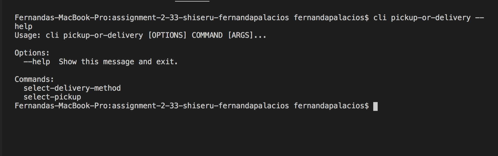
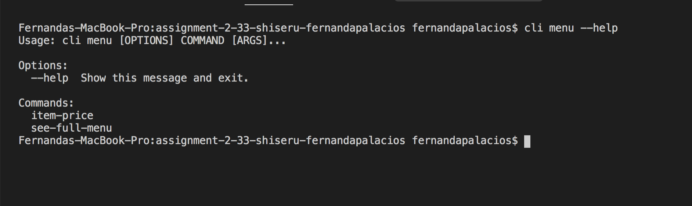
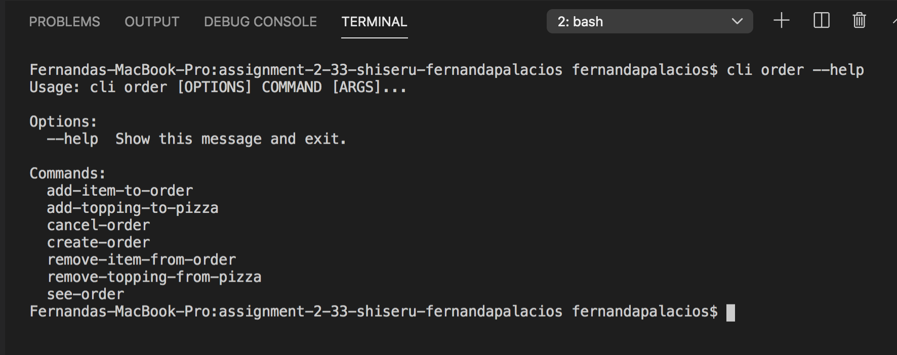
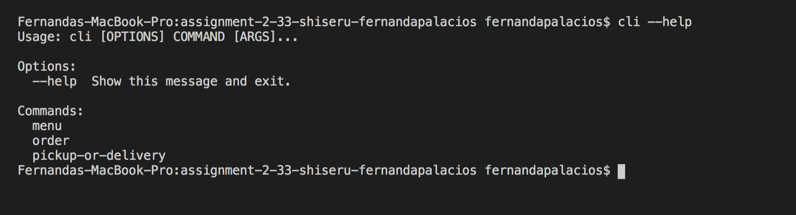

# A2

## 1. Instructions for using app

### Setup
- `pip install -r requirements.txt` install dependencies
- `python3 -m pip install --editable .` for cli app to work with the entry point of 'cli'

### Running the cli app
The commands are divided by groups (categories) and each group has its own available comands
Any command can be invoked as `cli {group} {command}` (examples section below)

**CLI Groups:**

**Comands for each group**

### Example usage of CLI/ documentation

Features based on category/groups:

- Menu
  - See  menu: 
    -  `cli menu see-entire-menu`
  - Get price of an item:
    - `cli menu item-price --item_id={item_id}`

- Order: 
  - Create a new order (**returns an order id - needed to add items to order**) 
    - `cli order create-order`

  - Add item to order (only pizza or drinks): 
    - `cli order add-item-to-order --order_id={order_id} --item_id={item_id}`

  - Remove item from order  (only pizza or drinks): : 
     - `cli order remove-item-from-order --order_id={order_id} --item_id={item_id}`

  - Add topping to pizza: 
    - `cli order add-topping-to-pizza --order_id={order_id} --pizza_item_id={pizza_item_id} --topping_item_id={topping_item_id}`

  - Remove topping from pizza: 
    - `cli order remove-topping-from-pizza --order_id={order_id} --pizza_item_id={pizza_item_id} --topping_item_id={topping_item_id}`

  - See order (order details): 
    - `cli order see-order --order_id={order_id}`

  - Cancel order: 
    - `cli order cancel-order --order_id={order_id}`

- Ask for pickup/delivery:
    - Pickup:
      - `cli  pickup-or-delivery select-pickup --order_id={order_id}`

    - Delivery
      -  `cli  pickup-or-delivery select-delivery_method --order_id={order_id} --method={method name eg ‘uber eats’} --address={address}`
      - Method must be one of {‘ubereats’, ‘in-house’, ‘foodora’}

Note: a cli method might be implemented as `see_full_menu` but it needs to be called as `see-full-menu` (with dashes not underscores) 

### Running the server
Run the main Flask module by running `python3 API.py`

### Running tests
- Run API unit tests with coverage by running `pytest --cov-report term --cov=. tests/api_unit_tests.py`

- Run our CLI tests with coverage by running `pytest --cov-report term --cov=. tests/cli_tests.py`

## 2. Pair Programming

## 3. Program Design

## 4. Tools Used (code craftsmanship)

In order to have a good programming and formatting style in your code, we used the following tools to help us:
- IDE (Visual Studio Code) and its `format document` command in order to format code during local development
- Linter github hook (autopep8 - which automatically formats Python code to conform to the PEP 8 style guide) (set up can be found here: https://github.com/csc301-fall-2020/assignment-2-33-shiseru-fernandapalacios/blob/main/lint.yml

