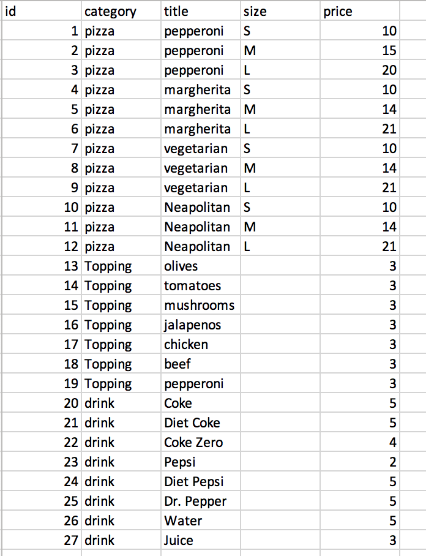

# A2

## 1. Instructions for using app

### Setup
- `pip install -r requirements.txt` install dependencies
- `python3 -m pip install --editable .` for CLI app to work with the entry point of `cli`

### Running the pizza parlour application

- First, run the server: `python3 API.py`
- The CLI can then be used on a separate shell. CLI commands can be invoked as `cli {group} {command}` (examples section available below)

*Note: The commands are divided by groups (`menu`, `order`, `pickup-or-delivery`) and each group has its own available comands (e.g. `cli menu see-full-menu`)(full documentation below)

### Menu and item id's

The menu is organized based on item id's (first column), required to use the application.

### Example usage of CLI/ documentation

Features based on category/groups:

- Menu
  - See  menu: 
    -  `cli menu see-full-menu`
  - Get price of an item:
    - `cli menu item-price --item_id={item_id}`

- Order: 
  - Create a new order (**returns an order id - needed to add items to order**) 
    - `cli order create-order`

  - Add item to order (only pizza or drinks): 
    - `cli order add-item-to-order --order_id={order_id} --item_id={item_id}`

  - Remove item from order  (only pizza or drinks): : 
     - `cli order remove-item-from-order --order_id={order_id} --item_id={item_id}`

  - Add topping to pizza: 
    - `cli order add-topping-to-pizza --order_id={order_id} --pizza_item_id={pizza_item_id} --topping_item_id={topping_item_id}`

  - Remove topping from pizza: 
    - `cli order remove-topping-from-pizza --order_id={order_id} --pizza_item_id={pizza_item_id} --topping_item_id={topping_item_id}`

  - See order (order details): 
    - `cli order see-order --order_id={order_id}`

  - Cancel order: 
    - `cli order cancel-order --order_id={order_id}`

- Ask for pickup/delivery:
    - Pickup:
      - `cli  pickup-or-delivery select-pickup --order_id={order_id}`

    - Delivery
      -  `cli  pickup-or-delivery select-delivery-method --order_id={order_id} --method={one of: ‘ubereats’, ‘in-house’, ‘foodora’} --address={address}`

*Note: ensure the CLI is used with valid cases (cancel an existing order, add pizza then topping, remove existing item, etc)

*Note: a CLI method might be implemented as `see_full_menu` but it needs to be called as `see-full-menu` (with dashes not underscores) 

#### Dynamically changing prices / customizing items:
If a client wishes to customize the prices used while running the application or to include a new pizza / item, they can do so by modifying the content from `menu.csv`: https://github.com/csc301-fall-2020/assignment-2-33-shiseru-fernandapalacios/blob/main/menu.csv

## 2. Running tests and coverage

- Run API unit tests with coverage for **API files** by running `pytest --cov-report term --cov=. tests/api_unit_tests.py`

- Run our CLI tests with coverage for **CLI files** by running `pytest --cov-report term --cov=. tests/cli_tests.py`

## 3. Pair Programming

## 4. Program Design

## 5. Tools Used (code craftsmanship)

In order to have a good programming and formatting style in our code, we used the following tools to help us:
- IDE (Visual Studio Code) and its `format document` command in order to format code during local development. In order to use this command, we installed an extension on Visual Studio Code for formatting python based on the python's standard PEP 8 style guide.
- Linter github hook (autopep8 - which automatically formats Python code to conform to the PEP 8 style guide) (set up can be found here: https://github.com/csc301-fall-2020/assignment-2-33-shiseru-fernandapalacios/blob/main/.github/workflows/lint.yml

